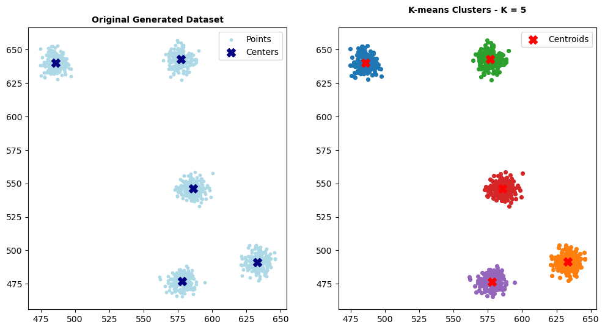

# 🐍 Programming for Data Science: A Project Portfolio 🚀

<p align="center">
    <!-- Project Links -->
    <a href="https://github.com/Silvestre17/Programming.for.DS_MasterProjects"></a>
</p>

## 📝 Description

This repository is a portfolio of assignments from the **Programming for Data Science** course. It showcases a progression of skills, starting with ***Python*** fundamentals and moving to advanced data manipulation with `Pandas`, and culminating in the from-scratch implementation of the K-Means clustering algorithm.

## ✨ Learning Objectives

This collection of projects demonstrates the development of core competencies in programming for data science, including:
*   Proficiency in core **Python programming**, including data structures, functions, and control flow.
*   Advanced **data wrangling and manipulation** using the `Pandas` and `NumPy` libraries.
*   The ability to **implement machine learning algorithms from scratch**, understanding their inner workings.
*   A practical approach to **problem-solving and algorithmic thinking**.

## 🎓 Project Context

This work was completed for the **Programming for Data Science** course in the **[Master's in Data Science and Advanced Analytics](https://www.novaims.unl.pt/en/education/programs/postgraduate-programs-and-master-degree-programs/master-degree-program-in-data-science-and-advanced-analytics-with-a-specialization-in-data-science/)** program at **NOVA IMS**, during the 1st trimester of the 2024/2025 academic year.

## 🛠️ Core Technologies Used

The projects were developed entirely within the Python ecosystem, leveraging its powerful libraries for scientific computing and data analysis.

<p align="center">
    <a href="https://www.python.org/">
        
    </a>
    <a href="https://jupyter.org/">
        
    </a>
    <a href="https://pandas.pydata.org/">
        
    </a>
    <a href="https://numpy.org/">
        
    </a>
    <a href="https://matplotlib.org/">
        
    </a>
</p>

---

## 📚 Assignments Breakdown

This repository is organized into the three main homework assignments from the course.

### 1️⃣ [**Homework 1:** Python Fundamentals & Data Structures](./PfDS_Homework1/)

This assignment focused on foundational Python programming skills, without relying on third-party data science libraries.

*   **Key Concepts Implemented:**
    *   **List Manipulation:** Generating random numbers, filtering (e.g., odd/even numbers), and sorting.
    *   **Loops & Conditionals:** Implementing a pipeline to automatically generate a list that meets specific criteria (e.g., equal number of odd and even values).
    *   **String Manipulation & Regular Expressions:** Parsing text from a file (`Alice.txt`) to count words, find the longest/shortest words, and identify unique words using `re`.
    *   **Dictionaries:** Managing and querying data stored in dictionaries to find the most popular song and the user who listened to the most songs.

### 2️⃣ [**Homework 2:** Data Wrangling with Pandas](./PfDS_Homework2/)

This project focused on loading, cleaning, and merging data from multiple sources (`.csv` and `.xlsx`), demonstrating proficiency with the **Pandas** library.

*   **Key Concepts Implemented:**
    *   **Data Loading:** Reading data from different file formats (`pd.read_csv`, `pd.read_excel`).
    *   **Filtering & Cleaning:** Removing non-country aggregates from the World Development Indicators (WDI) dataset and resetting DataFrame indexes.
    *   **Data Transformation:** Creating a pivot table to transform data from long to wide format.
    *   **Merging DataFrames:** Combining the `WDI` and `Penn World Table` datasets into a single, unified DataFrame using `pd.concat`.
    *   **Grouping & Aggregation:** Answering complex analytical questions by using `.groupby()` and `.agg()` to calculate statistics for different population segments.

### 3️⃣ Homework 3: K-Means Clustering From Scratch

This assignment involved a step-by-step implementation of the **K-Means clustering algorithm** in Python, focusing on understanding the mechanics of the algorithm without using high-level libraries like `scikit-learn`.

<p align="center">
  
</p>

*   **Key Components Implemented:**
    *   **Centroid Initialization:** A function to randomly select initial `K` centroids from the dataset.
    *   **Distance Calculation:** A function to compute the Euclidean distance between points.
    *   **Cluster Assignment:** A function to assign each data point to its nearest centroid.
    *   **Centroid Update:** A function to update centroid locations by calculating the mean of all points within a cluster.
    *   **Convergence Logic:** A `kmeans` wrapper function that iteratively refines clusters until the change in centroid positions falls below a tolerance threshold (`tol`).
    *   **Elbow Method:** Implemented the inertia calculation and used the "Elbow Method" to determine the optimal number of clusters (`K`) for a given dataset.

## 🚀 How to Run the Solutions

Each assignment is contained in its own Jupyter Notebook (`.ipynb`) within the respective homework folder.

1.  **Prerequisites:**
    *   Ensure you have **Python 3.x** and **Jupyter Notebook/JupyterLab** installed.
    *   It is highly recommended to use a virtual environment.

2.  **Install Dependencies:**
    *   Install the required Python libraries using pip:
        ```bash
        pip install pandas numpy matplotlib scipy
        ```

3.  **Launch and Run:**
    *   Navigate to the project's root directory in your terminal.
    *   Start Jupyter:
        ```bash
        jupyter notebook
        ```
    *   Open the desired homework notebook and run the cells sequentially to see the code, outputs, and visualizations.

## 👥 Team Work

*   **Homework 1:** André Silvestre & Santiago Taylor
*   **Homework 2:** André Silvestre & Filipa Pereira
*   **Homework 3:** André Silvestre & Umeima Mahomed